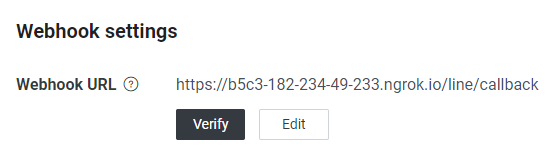
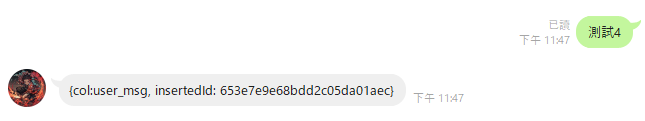
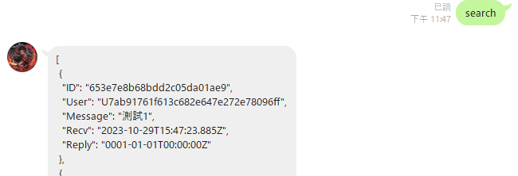
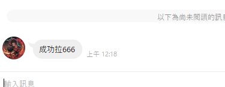

# Description

- A simple chat app

# Requirement

- Docker、MongoDB、Golang

# Setup

## Setup Docker

unbuntu
> /bin/bash script/install_docker_ubuntu.sh  

Windows
> https://docs.docker.com/desktop/install/windows-install/

## Setup MongoDB
> docker compose -f config/mongodb-compose.yaml up -d

## Config
>　config/*.env

## Build to app
Windows
> go build -o chatapp.exe

Linux
> go build -o chatapp

## Usage (chatapp with Line webhook url)
### Run chatapp as server

```
PS D:\Workspace\Go\test\chatapp> .\chatapp.exe server
[GIN-debug] [WARNING] Creating an Engine instance with the Logger and Recovery middleware already attached.

[GIN-debug] [WARNING] Running in "debug" mode. Switch to "release" mode in production.
 - using env:   export GIN_MODE=release
 - using code:  gin.SetMode(gin.ReleaseMode)

[GIN-debug] [WARNING] You trusted all proxies, this is NOT safe. We recommend you to set a value.
Please check https://pkg.go.dev/github.com/gin-gonic/gin#readme-don-t-trust-all-proxies for details.
[GIN-debug] Listening and serving HTTP on :6666
```

### Deploy locahost serving port to https endpoint 
```
PS D:\Workspace\Go\test\chatapp> ngrok http 6666
ngrok                                                                        

Introducing Always-On Global Server Load Balancer: https://ngrok.com/r/gslb 

Session Status                online
Session Expires               1 hour, 41 minutes
Terms of Service              https://ngrok.com/tos
Version                       3.3.5
Region                        Japan (jp)
Latency                       42ms
Web Interface                 http://127.0.0.1:4040
Forwarding                    https://b5c3-182-234-49-233.ngrok.io -> http://localhost:6666

Connections                   ttl     opn     rt1     rt5     p50     p90     
                              7       0       0.00    0.00    90.16   92.93   

HTTP Requests
-------------
```

### Paste Forwarding https url to Line developers > Channel > Messaging API > Webhook URL


### Test save and query 
Save user message to mongoDB



query user messages from mongoDB



## Usage (chatapp api)
### Get user messages by line user id from mongoDB
```
PS D:\Workspace\Go\test\chatapp> .\chatapp.exe message query -u "U7ab91761f613c682e647e272e78096ff"
[Chat App]2023/10/30 00:17:32.165374 D:/Workspace/Go/test/chatapp/service/db/db_mngr.go:70: Succeed to connect to mongoDB
[Chat App]2023/10/30 00:17:32.166373 D:/Workspace/Go/test/chatapp/service/line/line_api.go:75: [
        {
                "ID": "653e858e68bdd2c05da01aee",
                "User": "U7ab91761f613c682e647e272e78096ff",
                "Message": "測試",
                "Recv": "2023-10-29T16:17:18.17Z",
                "Reply": "0001-01-01T00:00:00Z"
        },
        {
                "ID": "653e859368bdd2c05da01aef",
                "User": "U7ab91761f613c682e647e272e78096ff",
                "Message": "測試1",
                "Recv": "2023-10-29T16:17:23.238Z",
                "Reply": "0001-01-01T00:00:00Z"
        }
]
[Chat App]2023/10/30 00:17:32.177873 D:/Workspace/Go/test/chatapp/cmd/message.go:104: [
        {
                "ID": "653e858e68bdd2c05da01aee",
                "User": "U7ab91761f613c682e647e272e78096ff",
                "Message": "測試",
                "Recv": "2023-10-29T16:17:18.17Z",
                "Reply": "0001-01-01T00:00:00Z"
        },
        {
                "ID": "653e859368bdd2c05da01aef",
                "User": "U7ab91761f613c682e647e272e78096ff",
                "Message": "測試1",
                "Recv": "2023-10-29T16:17:23.238Z",
                "Reply": "0001-01-01T00:00:00Z"
        }
]
PS D:\Workspace\Go\test\chatapp>
```

### Send messages to line user 
```
PS D:\Workspace\Go\test\chatapp> .\chatapp.exe message send -t "成功拉666" -u "U7ab91761f613c682e647e272e78096ff"
[Chat App]2023/10/30 00:18:58.572968 D:/Workspace/Go/test/chatapp/cmd/message.go:73: Succeed to message actionSend U7ab91761f613c682e647e272e78096ff 成功拉666
PS D:\Workspace\Go\test\chatapp> 
```

### Delete user messages by line user id in mongoDB
```
PS D:\Workspace\Go\test\chatapp> .\chatapp.exe message delete -u "U7ab91761f613c682e647e272e78096ff"
[Chat App]2023/10/30 00:15:31.962620 D:/Workspace/Go/test/chatapp/service/db/db_mngr.go:70: Succeed to connect to mongoDB
[Chat App]2023/10/30 00:15:31.963097 D:/Workspace/Go/test/chatapp/service/db/db_api.go:105: Number of documents deleted 5 in collection user_msg
[Chat App]2023/10/30 00:15:31.975096 D:/Workspace/Go/test/chatapp/cmd/message.go:129: Succeed to message actionDelete U7ab91761f613c682e647e272e78096ff
PS D:\Workspace\Go\test\chatapp>
```

### Demo
video/demo.mp4